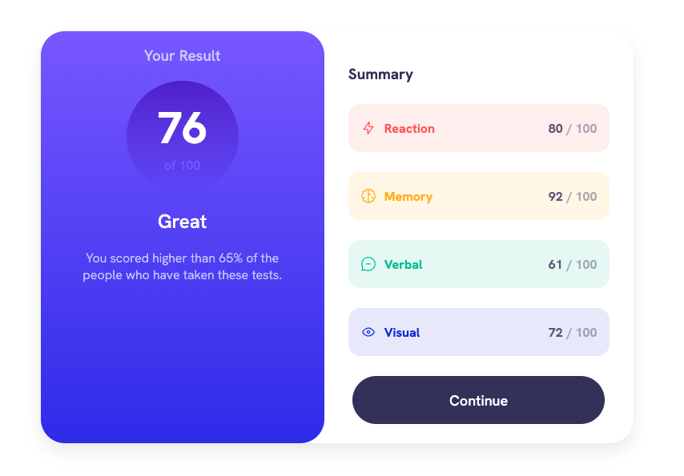

# Frontend Mentor - Results summary component solution

This is a solution to the [Results summary component challenge on Frontend Mentor](https://www.frontendmentor.io/challenges/results-summary-component-CE_K6s0maV). Frontend Mentor challenges help you improve your coding skills by building realistic projects.

## Table of contents

- [Overview](#overview)
  - [Screenshot](#screenshot)
  - [Links](#links)
- [My process](#my-process)
  - [Built with](#built-with)
  - [What I learned](#what-i-learned)
  - [Continued development](#continued-development)
- [Author](#author)

## Overview

### Screenshot

[See mobile screenshot here.](./screenshots/screenshot-mobile-active.png)

### Links

- Solution URL: [Add solution URL here](https://your-solution-url.com)
- Live Site URL: [https://waffleflopper.github.io/results-summary-project](https://your-live-site-url.com)

## My process

### Built with

- HTML (some semantic)
- SASS/CSS
- Vanilla JS

### What I learned

I picked this project as a kind of starting point to seeing what [frontendmentor.io](http://frontendmentor.io) was all about. I've found that some sites label things "junior" or "newbie" feel far from newbie to - or are written in a way that just ends up confusing someone that's new to the entire world of web-based languages.

It's been a while since I did any front-end (or back-end for that matter) so I figured starting simple would be a good way to dust off the cobwebs, so to speak.

### Continued development

My aim is to become more comfortable using SASS, since it makes working with CSS far more pleasant, and vanilla JS/TS. I initially learned JS in conjuction with frameworks that did a lot of heavy lifting for me - so as I move to transition out of the Army and into web development I want to be sure to close those gaps.

## Author

- Website - [GitHub Pages](https://waffleflopper.github.io) - nothing up yet, work in progress
- Frontend Mentor - [@waffleflopper](https://www.frontendmentor.io/profile/waffleflopper)
- Twitter - [@im_robertjames](https://www.twitter.com/im_robertjames)
